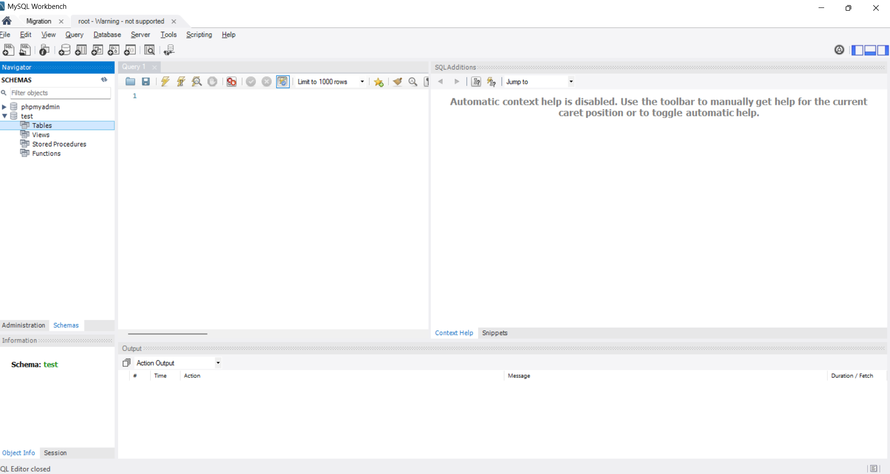

# what is DBMS ?
1. dbms stands for databse mangment system
2. dbms create database and manage database
3. dbms is also create and manage databse via MYSQL | MYSQLWORKBENCH | SQLlite
4. how to install xampp and open mysql database

    **screenshots**

    
 5. how to install MYSQLWorkbench and open it 
      

    '''
    X - cross platform support all OS
    A - apache server
    M - mysql database
    P - perl
    P - php

## what is database ?
 1. databse stored an information about data in form of table called database
 2. database stored information called database
 3. database  created via sql 

 ## what is RDBMS ?

    1. rdbms stands for relational database mangement system
    2. rdbms is used to provide relational between two database
    3. rdms is used to stablishe relational between database 
