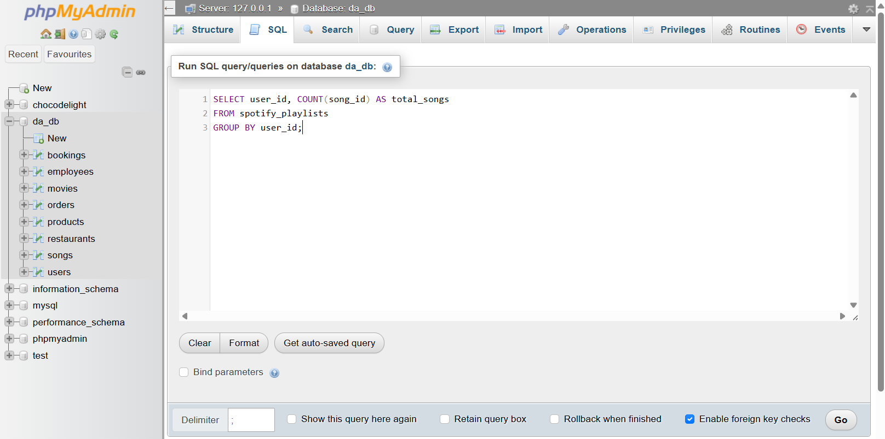

# Task: Count Songs Added to a User's Playlist

Using the `COUNT()` function, find out how many songs a user has added to their playlist in a table named `spotify_playlists` (columns: `playlist_id`, `user_id`, `song_id`).

'''sql
SELECT user_id, COUNT(song_id) AS total_songs
FROM spotify_playlists
GROUP BY user_id;
'''

