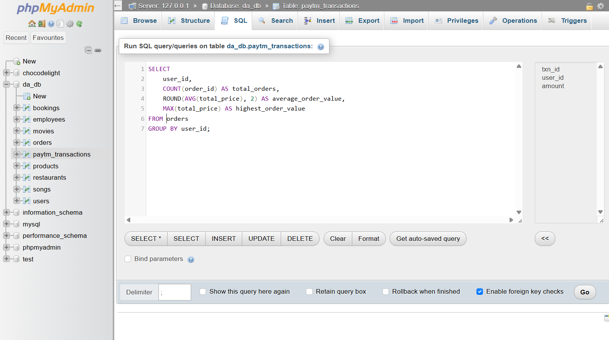

# Task: Get Order Statistics for Each User

'''sql

SELECT 
    user_id,
    COUNT(order_id) AS total_orders,
    ROUND(AVG(total_price), 2) AS average_order_value,
    MAX(total_price) AS highest_order_value
FROM myntra_orders
GROUP BY user_id;

'''

**screenshot**

